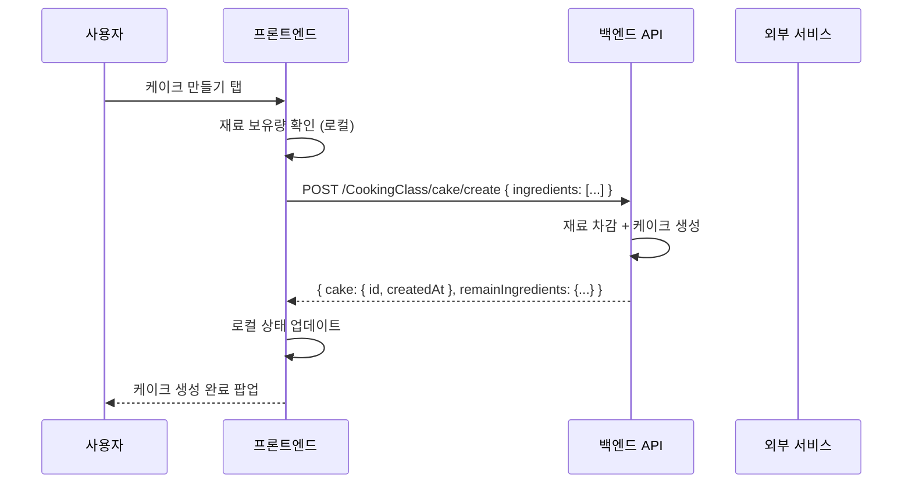

# data-flow

기획서를 읽고 데이터의 생성 → 가공 → 표시 → 저장 흐름을 정리한다. Mermaid 시퀀스 다이어그램, 데이터 모델, API 엔드포인트 초안을 만든다. 개발회의 전에 작성하여 논의 기반을 만든다.

---

## 선행조건

`/dev`가 진입 전 state.json으로 이미 검증한다. 이 스킬은 별도 확인 없이 바로 실행한다.

---

## 입력

`.dev-work/<작업번호>/state.json`의 `finalSpec.pageId`를 읽어 Notion MCP로 "최종 기획서" 페이지 내용을 로드한다. 이미 2.2에서 업로드된 기획서를 기반으로 작업한다.

---

## 처리 흐름

### (1) 데이터 항목 추출

기획서에서 모든 데이터 항목을 식별한다:

- **사용자 입력** — 폼 필드, 선택값, 버튼 동작
- **API 요청/응답** — 서버와 주고받는 데이터
- **로컬 저장** — 캐시, UserDefaults, DB
- **외부 서비스** — CDN, 푸시, 결제, 분석

### (2) 데이터 흐름 정리

각 데이터 항목의 생명주기:
```
생성(입력/수신) → 가공(변환/검증) → 표시(UI 렌더링) → 저장(로컬/서버)
```

### (3) 파트별 책임 구분

| 파트 | 책임 |
|------|------|
| 프론트엔드 | UI 입력 수집, 데이터 표시, 로컬 캐시, 상태 관리 |
| 백엔드 | API 처리, 데이터 검증, 영속 저장, 비즈니스 로직 |
| 외부 서비스 | CDN, 푸시 알림, 결제 등 |

### (4) Mermaid 시퀀스 다이어그램

`sequenceDiagram`으로 작성한다. 주요 데이터 흐름별로 다이어그램을 분리한다.

> **주의:** 레이블 문자열 내에 `\n`(개행 이스케이프)을 사용하면 Mermaid 파싱 오류가 발생한다. 여러 줄이 필요한 경우 레이블을 짧게 유지하거나 `Note over`로 분리한다.



### (5) 데이터 모델 정의

| 엔티티 | 필드 | 타입 | 설명 | 소스 |
|--------|------|------|------|------|
| Ingredient | type | enum | 밀가루/생크림/달걀/딸기 | 서버 |
| Ingredient | count | Int | 보유 수량 | 서버 |
| Cake | id | String | 케이크 고유 ID | 서버 |
| Cake | createdAt | Date | 생성 시간 | 서버 |
| ... | ... | ... | ... | ... |

### (6) API 엔드포인트 초안

경로는 `/도메인명/...` 형식을 사용한다. 기획서의 기능 도메인명을 접두사로 쓴다.

| Method | Path | 설명 | Request | Response |
|--------|------|------|---------|----------|
| GET | /CookingClass/status | 이벤트 상태 조회 | - | EventStatus |
| GET | /CookingClass/ingredients | 재료 보유 현황 | - | Ingredients |
| POST | /CookingClass/cake/create | 케이크 생성 | CreateCakeReq | Cake |
| POST | /CookingClass/cake/gift | 케이크 선물 | GiftCakeReq | GiftResult |
| GET | /CookingClass/ranking | 랭킹 조회 | page, type | RankingList |
| ... | ... | ... | ... | ... |

---

## 사용자 확인

다이어그램, 데이터 모델, API 초안을 사용자에게 보여주고 확인을 받는다:
```
이 내용을 Notion에 저장하시겠습니까?
```

---

## Notion 저장

**skills/common/notion-writer** 스킬을 사용하여 작업번호 페이지 하위에 **"데이터 흐름도"** 서브페이지를 생성한다:

```
[작업번호] 데이터 흐름도
├── 담당자: [worker]
├── 상태: 작성완료
├── 흐름도
│   └── Mermaid 다이어그램 + 데이터 모델 정의 + API 엔드포인트 초안
├── 논의사항
│   └── (빈 섹션 — 개발회의에서 작성)
└── 수정사항
    └── (빈 섹션 — 회의 결과 기록)
```

논의사항과 수정사항은 **빈 섹션으로 생성**한다. 개발회의에서 팀이 직접 채운다.

---

> 이 스킬의 산출물은 `validate-guard.js`(PreToolUse Hook)가 자동 검증합니다.
> 출력 포맷 변경 시 해당 훅의 3.2 규칙 블록을 동기화해야 합니다.
