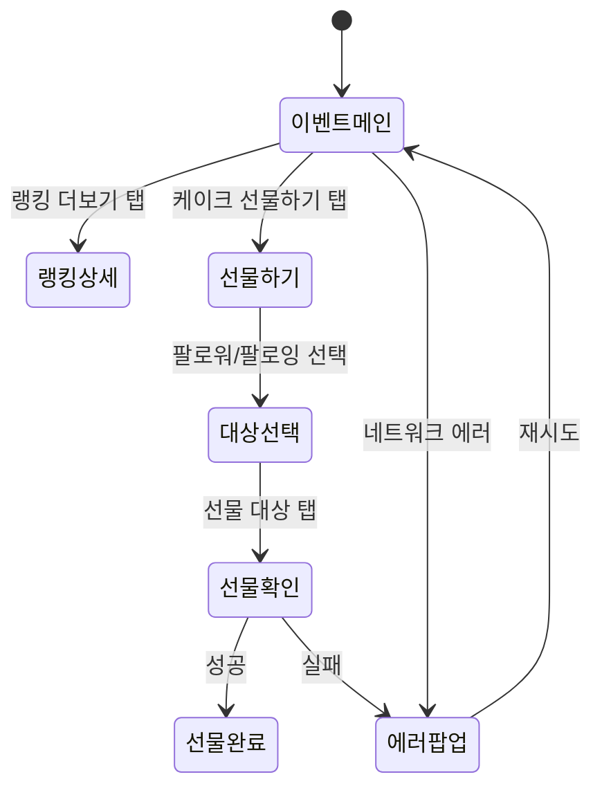

# ui-flow

기획서를 읽고 화면 간 전환 관계를 Mermaid 다이어그램으로 정리한다. 개발회의 전에 작성하여 논의 기반을 만든다.

---

## 선행조건

1단계(기획서 검토)가 완료되어야 한다. **skills/common/notion-writer** 스킬로 "기획서 검토" 서브페이지 존재 여부를 확인한다.

미완료 시:
```
기획서 검토가 먼저 완료되어야 합니다. 1단계부터 진행해주세요.
```

---

## 입력

사용자에게 최종 기획서(기획자가 피드백 반영 후 전달한 것) 경로를 질문한다:
```
검토를 거쳐 보완된 최종 기획서 PDF 경로를 알려주세요.
```

---

## 처리 흐름

### (1) 화면 목록 추출

기획서에서 모든 화면(Screen)을 식별하고 목록화한다:

| 화면 | 역할 | 주요 요소 |
|------|------|----------|
| 이벤트 메인 | 이벤트 진입점, BJ/FAN 탭 | 탭 바, 참여 방법, 랭킹 미리보기 |
| 랭킹 상세 | 순위 목록 | 유저 리스트, 페이지네이션 |
| ... | ... | ... |

### (2) 화면 간 전환 관계

각 화면에서 다른 화면으로 이동하는 조건과 트리거를 정리:
- **진입 조건** — 어떤 상태에서 이 화면에 도달하는가
- **이동 트리거** — 버튼 탭, 스와이프, 시스템 이벤트 등
- **뒤로가기 동작** — 이전 화면, 홈, 닫기 등

### (3) 엣지 케이스별 분기

- 에러 발생 → 얼럿/토스트/에러 화면
- 권한 거부 → 설정 화면 이동 안내
- 데이터 없음 → 빈 상태 화면
- 네트워크 오류 → 재시도 화면

### (4) Mermaid 다이어그램 작성

`stateDiagram-v2`로 작성한다:



### (5) 화면별 상태 정의 요약

| 화면 | 상태 | 설명 |
|------|------|------|
| 이벤트메인 | 로딩 | 이벤트 데이터 로드 중 |
| 이벤트메인 | 시작 전 | 이벤트 기간 전 (카운트다운) |
| 이벤트메인 | 진행 중 | 정상 상태 |
| 이벤트메인 | 종료 | 이벤트 종료 후 결과 |
| 이벤트메인 | 에러 | 로드 실패, 재시도 |

---

## 사용자 확인

다이어그램과 상태 정의를 사용자에게 보여주고 확인을 받는다:
```
이 내용을 Notion에 저장하시겠습니까?
```

---

## Notion 저장

**skills/common/notion-writer** 스킬을 사용하여 작업번호 페이지 하위에 **"UI 흐름도"** 서브페이지를 생성한다:

```
[작업번호] UI 흐름도
├── 담당자: [worker]
├── 상태: 작성완료
├── 흐름도
│   └── Mermaid 다이어그램 + 화면별 상태 정의 요약
├── 논의사항
│   └── (빈 섹션 — 개발회의에서 작성)
└── 수정사항
    └── (빈 섹션 — 회의 결과 기록)
```

논의사항과 수정사항은 **빈 섹션으로 생성**한다. 개발회의에서 팀이 직접 채운다.

---

> 이 스킬의 산출물은 `skills/common/validate` 규칙에 따라 검증됩니다.
> 출력 포맷 변경 시 해당 규칙 블록을 동기화해야 합니다.
